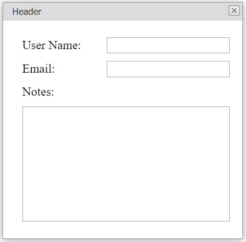

<!-- default badges list -->

[](https://supportcenter.devexpress.com/ticket/details/E2571)
[](https://docs.devexpress.com/GeneralInformation/403183)
<!-- default badges end -->
# Popup Control for ASP.NET Web Forms - How to resize the pop-up window based on to the content page size
<!-- run online -->
**[[Run Online]](https://codecentral.devexpress.com/e2571/)**
<!-- run online end -->

This example demonstrates how to change the size of a pop-up window based on the size of the content page within the control's iframe.



## Overview

Handle the popup control's client-side `Init` event. In the handler, call the control's [GetContentIFrame](https://docs.devexpress.com/AspNet/js-ASPxClientPopupControlBase.GetContentIFrame) method to get the control's iframe and attach the `OnContentLoaded` event handler to the iframe's `Load` event.

```js
function onPopupInit(s, e) {
    var iframeElement = s.GetContentIFrame();
    ASPxClientUtils.AttachEventToElement(iframeElement, 'load', function (event) {
        onContentLoaded(event, s)
    });
}
```

In the `OnContentLoaded` event handler, calculate the size of the content page within the iframe and specify the pop-up window's size based on this calculation.

```js
function onContentLoaded(e, popup) {
    var array = calculateSize(popup, popup.GetContentIFrame(), popup.GetContentIFrameWindow().document);
    popup.SetSize(array[0], array[1]);
}
function calculateSize(popup, popupiframe, contentDocument) {
    var windowElement = popup.GetWindowElement(-1);
    var scrollX = contentDocument.documentElement.scrollWidth;
    var scrollY = contentDocument.documentElement.scrollHeight;
    var offsetX = windowElement.offsetWidth - popupiframe.offsetWidth;
    var offsetY = windowElement.offsetHeight - popupiframe.offsetHeight;
    var width = scrollX + offsetX;
    var height = scrollY + offsetY;
    if (window.navigator.userAgent.indexOf("Edge") > -1) {
        width += 10;
        height += 10;
    }
    var array = [width, height];
    return array;
}
```

## Files to Review

* [Default.aspx](./CS/E2571/Default.aspx) (VB: [Default.aspx](./VB/E2571/Default.aspx))
* [Content.aspx](./CS/E2571/Content.aspx) (VB: [Content.aspx](./VB/E2571/Content.aspx))
